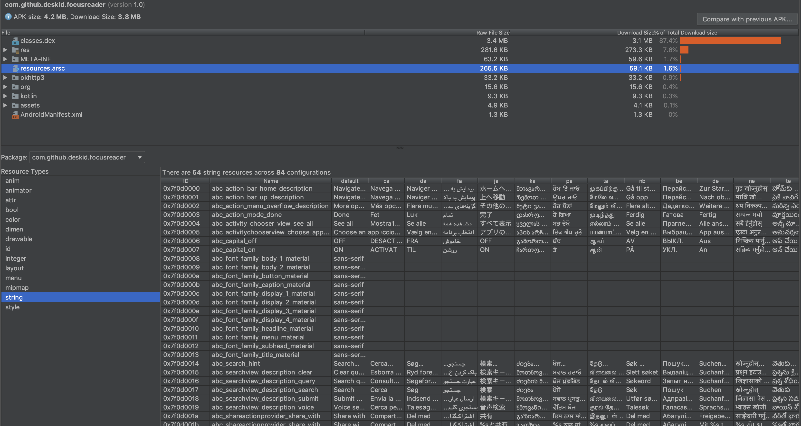

Tool for getting all kinds of information about an APK, including: basic package info, sizes and files list, dex code, resources




### use case

1. export full `string.xml` file from apk

    ```java
    PrintStream stream = new PrintStream("string.xml");
    ApkAnalyzer apkAnalyzer = new ApkAnalyzer(apkPath);
    
    stream.print("<?xml version=\"1.0\" encoding=\"utf-8\"?>\n" +
            "<resources>");
    
    apkAnalyzer.resNames("string", "default", null)
            .doOnNext(s -> stream.print("<string name=\"" + s + "\">"))
            .flatMap(key -> apkAnalyzer.resValue("string", "default", key, null))
            .doOnComplete(() -> {
                stream.print("</resources>");
                apkAnalyzer.close();
            })
            .subscribe(value -> {
                stream.print(value);
                stream.print("</string>\n");
            });
    
    stream.close();
    ```

    `string.xml`
    
    ```
    <?xml version="1.0" encoding="utf-8"?>
    <resources>
        <string name="abc_action_bar_home_description">Navigate Home</string>
        <string name="abc_action_bar_up_description">Navigate up</string>
        <string name="abc_action_menu_overflow_description">More Options</string>
        <string name="abc_action_mode_done">Done</string>
        <string name="abc_activity_chooser_view_see_all">See All</string>
        ......
    </resources> 
    ```

2. export `public.txt` from apk

    ```java
    PrintStream stream = new PrintStream("public.txt");
    ApkAnalyzer apkAnalyzer = new ApkAnalyzer(apkPath);
    
    String packageName = apkAnalyzer.manifestAppId();
    Disposable disposable = apkAnalyzer.resNames("string", "default", null)
            .doOnNext(s -> stream.print(packageName + ":string/" + s + " = "))
            .flatMap(key -> apkAnalyzer.resId("string", "default", key, null))
            .doOnComplete(apkAnalyzer::close)
            .subscribe(s -> stream.print(s + "\n"));
    
    stream.close();
    ```
    
    `public.txt`
    
    ```
    com.github.deskid.focusreader:string/abc_action_bar_home_description = 0x7f0d0000
    com.github.deskid.focusreader:string/abc_action_bar_up_description = 0x7f0d0001
    com.github.deskid.focusreader:string/abc_action_menu_overflow_description = 0x7f0d0002
    com.github.deskid.focusreader:string/abc_action_mode_done = 0x7f0d0003
    com.github.deskid.focusreader:string/abc_activity_chooser_view_see_all = 0x7f0d0004
    com.github.deskid.focusreader:string/abc_activitychooserview_choose_application = 0x7f0d0005
    ```